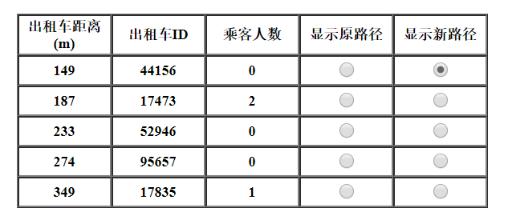
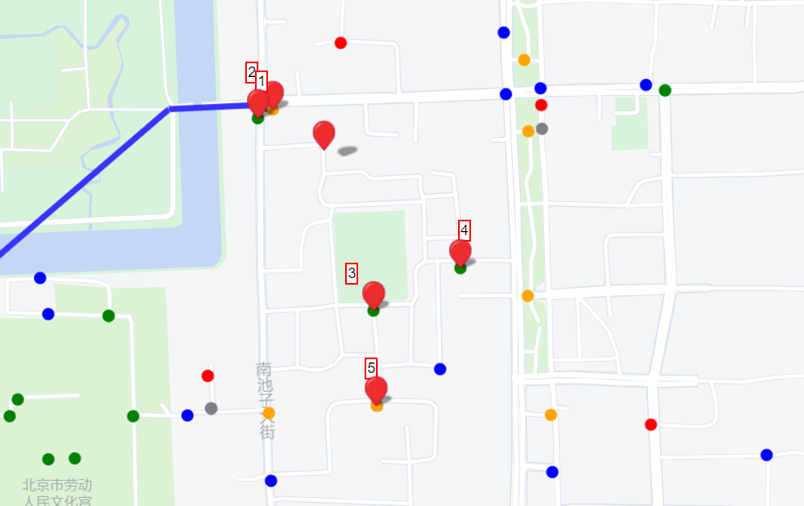
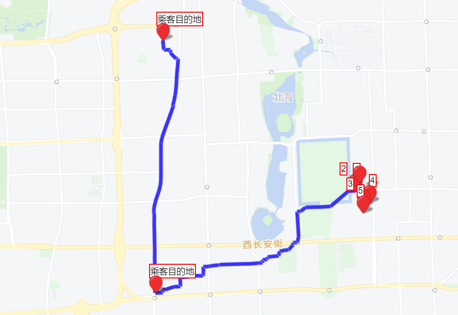
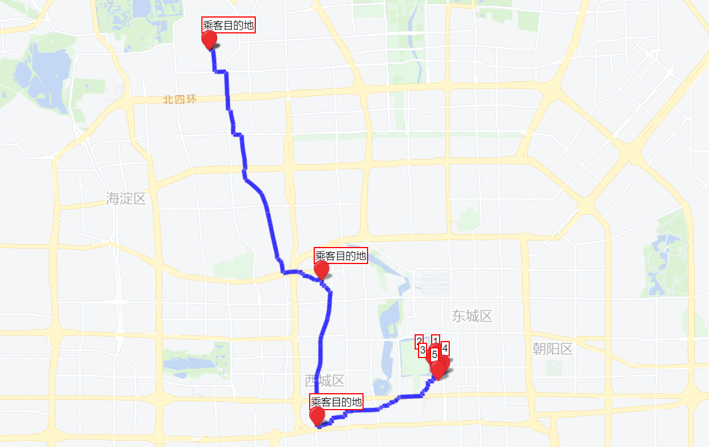

# 互联网出行

包含很多出租车的路网中，给定起点终点，寻找合适的车辆实现拼车

## 效果展示：

设定起点终点(也可配合radio button在地图上取点)


查找出租车


带颜色的点表示出租车(绿色,蓝色,橙色,红色分别代表车上已经有0到4名乘客)


展示出租车原路径：


展示如果拼车的新路径：



## 项目结构与构建：

- data/ 车辆、节点和边的数据，初次运行服务器后会在此生成GTree的数据文件，下次运行直接加载
- frontend/ 前端项目文件，使用npm进行包管理，webpack进行构建
    * 运行npm install安装所需的包
    * 运行npm run build在dist目录下生成打包后的js文件被index.html引用
    * index.html中引用了百度地图api网址，需要去百度地图申请api_key，填入对应位置
- server/ 使用c++实现的后端服务器
    * 在win10 subsystem for linux(ubuntu 18.04)上构建成功
    * 依赖于pthread, metis库，metis需要手动安装
        - ubuntu可以通过```sudo apt-get install libmetis-dev```安装
        - 或者从```http://glaros.dtc.umn.edu/gkhome/metis/metis/download```下载
    * ```make```编译生成服务端程序server

## 运行方式

- 前端项目```/frontend/dist/app.js```是已经构建好的应用
- 通过make构建好server后，运行```./server```启动服务器
- 输出```server start Listening on port 8080```信息后，服务器启动完成
- 前端项目使用了百度地图api，请确保已经联网，之后在浏览器中运行```http://localhost:8080```访问项目

## 第三方项目：

### 后端

- GTree(支持路网中快速查询两点最短距离以及最短路径的树): https://github.com/TsinghuaDatabaseGroup/GTree
- cpp-httplib(c++实现的单文件http库): https://github.com/yhirose/cpp-httplib
- json(json for modern c++): https://github.com/nlohmann/json

### 前端

- 百度地图api(地图显示，标点): https://lbsyun.baidu.com/index.php?title=jspopular3.0
- mapv(用于绘制大量点和线): https://github.com/huiyan-fe/mapv
- jquery: https://jquery.com/
- core-js(polyfill库，让项目可以支持更多浏览器): https://github.com/zloirock/core-js
